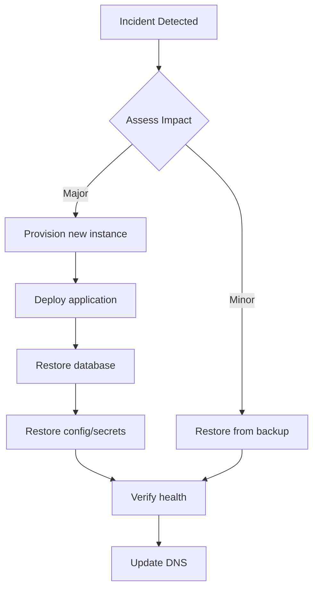

# Backup & Disaster Recovery Guide

## PostgreSQL Backup

### Automated Backup Script

A backup script is provided at `scripts/backup.sh`:

```bash
# Run manually
bash scripts/backup.sh

# Schedule via cron (daily at 2 AM)
0 2 * * * /path/to/Address/scripts/backup.sh
```

The script creates timestamped backups:
- Location: `./backups/`
- Format: `customer360_YYYYMMDD_HHMMSS.sql.gz`
- Retention: Last 7 daily + last 4 weekly backups

### Manual Backup

```bash
# Using docker exec
docker exec -t address-postgres-1 pg_dump -U customer360 customer360 | gzip > backup_$(date +%Y%m%d).sql.gz

# Using pg_dump directly (if PostgreSQL is accessible)
pg_dump -h localhost -U customer360 -d customer360 -F c -f backup.dump
```

### Backup Strategy

| Type | Frequency | Retention | Location |
|------|-----------|-----------|----------|
| Full DB | Daily | 7 days | Local disk |
| Full DB | Weekly | 4 weeks | Local disk |
| Config | On change | Git history | Git repo |
| .env | On change | Git (encrypted) | Secure storage |

### What to Backup

1. **PostgreSQL database** (primary)
2. **Environment files** (`server/.env`, `.env` files)
3. **SSL certificates** (`./ssl/`)
4. **Docker configuration** (`docker-compose.yml`, `Dockerfile`)
5. **Application code** (in Git)

## Restore Procedure

### Restore from SQL dump
```bash
# Drop and recreate database
docker exec -t address-postgres-1 psql -U customer360 -c "DROP DATABASE IF EXISTS customer360;"
docker exec -t address-postgres-1 psql -U customer360 -c "CREATE DATABASE customer360;"

# Restore
gunzip -c backup_20240115_020000.sql.gz | docker exec -i address-postgres-1 psql -U customer360 -d customer360
```

### Full Disaster Recovery

1. **Provision new EC2 instance**
2. **Install Docker and Docker Compose**
3. **Clone repository**
4. **Restore .env file** from secure storage
5. **Restore SSL certificates**
6. **Restore PostgreSQL** from latest backup
7. **Start services**: `docker compose up -d`
8. **Verify health**: `curl http://localhost:8000/health`

## Recovery Time Objectives (RTO)
- Database restore: < 30 minutes
- Full infrastructure recovery: < 2 hours

## Recovery Point Objectives (RPO)
- Daily backups: maximum 24-hour data loss
- Weekly backups: maximum 7-day data loss (for historical)

## Disaster Recovery Workflow



## Testing Backup Recovery

Test the restore procedure monthly:
```bash
# 1. Create a test database
docker exec -t address-postgres-1 psql -U customer360 -c "CREATE DATABASE customer360_test;"

# 2. Restore into test DB
gunzip -c latest_backup.sql.gz | docker exec -i address-postgres-1 psql -U customer360 -d customer360_test

# 3. Verify row counts
docker exec -t address-postgres-1 psql -U customer360 -d customer360_test -c "SELECT count(*) FROM customers;"

# 4. Drop test database
docker exec -t address-postgres-1 psql -U customer360 -c "DROP DATABASE customer360_test;"
```
